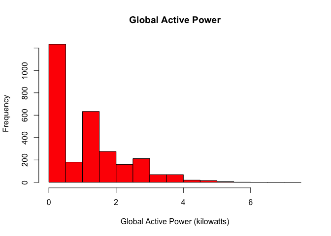
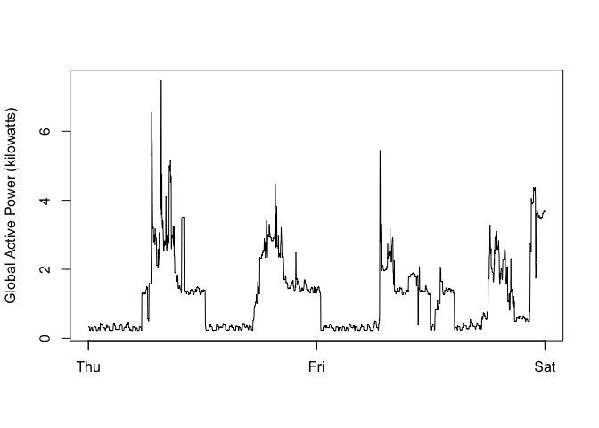
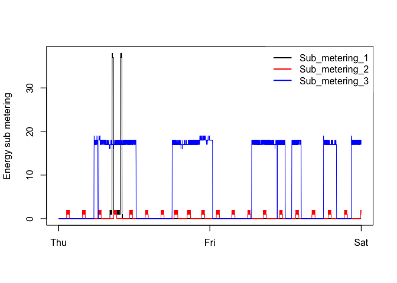
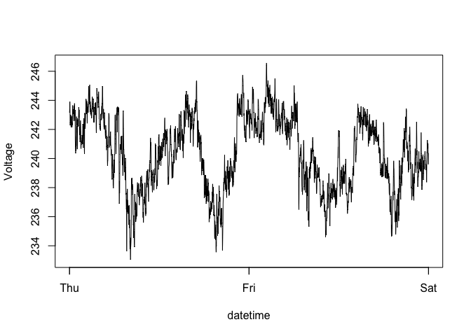
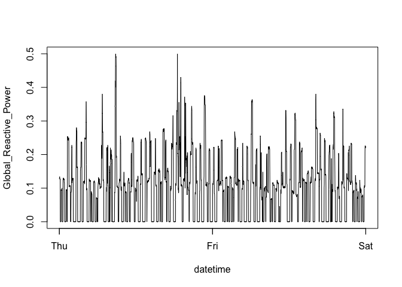
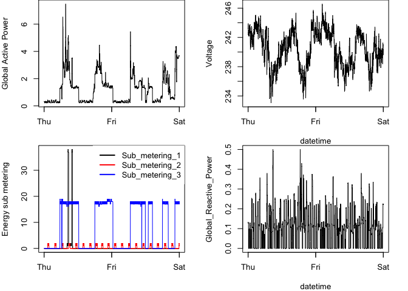

Plot Instructions
================

## Read Data

Data is kept one level above git repo. It is a very large file, so not
included in Git repo.

``` r
hspower <- read.table("../household_power_consumption.txt",header = TRUE, sep = ";")
```

``` r
str(hspower)
```

    ## 'data.frame':    2075259 obs. of  9 variables:
    ##  $ Date                 : chr  "16/12/2006" "16/12/2006" "16/12/2006" "16/12/2006" ...
    ##  $ Time                 : chr  "17:24:00" "17:25:00" "17:26:00" "17:27:00" ...
    ##  $ Global_active_power  : chr  "4.216" "5.360" "5.374" "5.388" ...
    ##  $ Global_reactive_power: chr  "0.418" "0.436" "0.498" "0.502" ...
    ##  $ Voltage              : chr  "234.840" "233.630" "233.290" "233.740" ...
    ##  $ Global_intensity     : chr  "18.400" "23.000" "23.000" "23.000" ...
    ##  $ Sub_metering_1       : chr  "0.000" "0.000" "0.000" "0.000" ...
    ##  $ Sub_metering_2       : chr  "1.000" "1.000" "2.000" "1.000" ...
    ##  $ Sub_metering_3       : num  17 16 17 17 17 17 17 17 17 16 ...

There are 2075259 entries, which is a large dataframe. We need to make
the following changes

- Convert Date to a readable format

``` r
library(lubridate)
```

    ## 
    ## Attaching package: 'lubridate'

    ## The following objects are masked from 'package:base':
    ## 
    ##     date, intersect, setdiff, union

``` r
## We will use lubridate functions
## Convert all columns 3 to 9 to numeric
hspower$Date <- dmy(hspower$Date)
```

``` r
str(hspower) ## Check up
```

    ## 'data.frame':    2075259 obs. of  9 variables:
    ##  $ Date                 : Date, format: "2006-12-16" "2006-12-16" ...
    ##  $ Time                 : chr  "17:24:00" "17:25:00" "17:26:00" "17:27:00" ...
    ##  $ Global_active_power  : chr  "4.216" "5.360" "5.374" "5.388" ...
    ##  $ Global_reactive_power: chr  "0.418" "0.436" "0.498" "0.502" ...
    ##  $ Voltage              : chr  "234.840" "233.630" "233.290" "233.740" ...
    ##  $ Global_intensity     : chr  "18.400" "23.000" "23.000" "23.000" ...
    ##  $ Sub_metering_1       : chr  "0.000" "0.000" "0.000" "0.000" ...
    ##  $ Sub_metering_2       : chr  "1.000" "1.000" "2.000" "1.000" ...
    ##  $ Sub_metering_3       : num  17 16 17 17 17 17 17 17 17 16 ...

OK, we need only data from 2007-02-01 to 2007-02-02

``` r
from <- ymd("2007-02-01")
to <- ymd("2007-02-02")
hspower <- hspower[hspower$Date %in% from:to,]
```

``` r
dim(hspower) ## Checkup
```

    ## [1] 2880    9

Now there are 2880 values, down from 2075259. Easier and faster to
handle. Now we need to

1.  Make columns 3 to 9 numeric

2.  Make a datetime column to combine Date and Time values

``` r
hspower[,3:9]<- lapply(hspower[,3:9],as.numeric)
hspower$datetime <- ymd_hms(paste(hspower[,1],hspower[,2]))
```

``` r
str(hspower) ## Checkup
```

    ## 'data.frame':    2880 obs. of  10 variables:
    ##  $ Date                 : Date, format: "2007-02-01" "2007-02-01" ...
    ##  $ Time                 : chr  "00:00:00" "00:01:00" "00:02:00" "00:03:00" ...
    ##  $ Global_active_power  : num  0.326 0.326 0.324 0.324 0.322 0.32 0.32 0.32 0.32 0.236 ...
    ##  $ Global_reactive_power: num  0.128 0.13 0.132 0.134 0.13 0.126 0.126 0.126 0.128 0 ...
    ##  $ Voltage              : num  243 243 244 244 243 ...
    ##  $ Global_intensity     : num  1.4 1.4 1.4 1.4 1.4 1.4 1.4 1.4 1.4 1 ...
    ##  $ Sub_metering_1       : num  0 0 0 0 0 0 0 0 0 0 ...
    ##  $ Sub_metering_2       : num  0 0 0 0 0 0 0 0 0 0 ...
    ##  $ Sub_metering_3       : num  0 0 0 0 0 0 0 0 0 0 ...
    ##  $ datetime             : POSIXct, format: "2007-02-01 00:00:00" "2007-02-01 00:01:00" ...

OK \## Plotting

### Plot 1

``` r
hist(hspower$Global_active_power, col = "red", xlab = "Global Active Power (kilowatts)", main = "Global Active Power")
```

<!-- -->

### Plot 2

``` r
plot(hspower$datetime,hspower$Global_active_power, type = "l", xlab="",ylab="Global Active Power (kilowatts)")
```

<!-- -->

### Plot 3

``` r
plot(hspower$datetime,hspower$Sub_metering_1, type = "l", xlab="",ylab="Energy sub metering")
lines(hspower$datetime,hspower$Sub_metering_2,col = "red")
lines(hspower$datetime,hspower$Sub_metering_3,col = "blue")
legend(x="topright",legend=c("Sub_metering_1","Sub_metering_2","Sub_metering_3"), col=c("black","red","blue"), lwd=2, box.lwd=0)
```

<!-- -->

### Plot 4

This requires generating two plots we have not generated before, and two
(Plot 2 and 3) which we already have.

#### Plot 4 top right

``` r
plot(hspower$datetime,hspower$Voltage, type = "l", xlab="datetime",ylab="Voltage")
```

<!-- -->

#### Plot 4 bottom right

``` r
plot(hspower$datetime,hspower$Global_reactive_power, type = "l", xlab="datetime",ylab="Global_Reactive_Power")
```

<!-- -->

To get Plot 4, we need to plot these separately.The code for the
individual plot functions is almost the same as the individual codes
abobe, but some trial and error adjustments have been made.

``` r
par(mfrow = c(2,2), mar=c(4,4,0,2))

plot(hspower$datetime,hspower$Global_active_power, type = "l", xlab="",ylab="Global Active Power")

plot(hspower$datetime,hspower$Voltage, type = "l", xlab="datetime",ylab="Voltage")

plot(hspower$datetime,hspower$Sub_metering_1, type = "l", xlab="",ylab="Energy sub metering")
lines(hspower$datetime,hspower$Sub_metering_2,col = "red")
lines(hspower$datetime,hspower$Sub_metering_3,col = "blue")
legend(x="topright",legend=c("Sub_metering_1","Sub_metering_2","Sub_metering_3"), col=c("black","red","blue"), lwd=2, box.lwd = 0)

plot(hspower$datetime,hspower$Global_reactive_power, type = "l", xlab="datetime",ylab="Global_Reactive_Power")
```

<!-- -->
